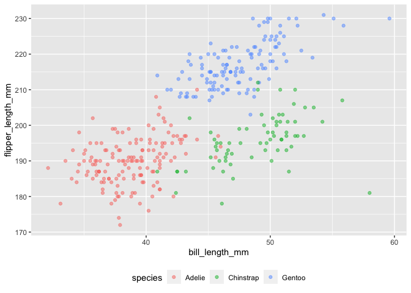

Homework 1
================
Lydia Parr
2019-09-29

## Problem 1.

I am creating a data frame with:

-   a random sample of size 10 from a standard Normal distribution
-   a character vector of length 10
-   a logical vector indicating whether elements of the sample are
    greater than 0
-   a factor vector of length 10, with 3 different factor “levels”

``` r
hw1_df = tibble(
  norm_samp = rnorm(10, mean = 0), 
  vec_char = c("a", "b", "c", "d", "e", "f", "g", "h", "i", "j"),
  vec_logical = ifelse(norm_samp > 0, print("Positive"), print("Not")),
  vec_factor = (c("low", "low", "low", "med", "med", "med", "med", "high", "high", "high")) 
)
```

Now I am trying to take mean of each variable in the data frame.

``` r
mean_samp = mean(pull(hw1_df, norm_samp))

mean_char = mean(pull(hw1_df, vec_char))
```

    ## Warning in mean.default(pull(hw1_df, vec_char)): argument is not numeric or
    ## logical: returning NA

``` r
mean_logic = mean(pull(hw1_df, vec_logical))
```

    ## Warning in mean.default(pull(hw1_df, vec_logical)): argument is not numeric or
    ## logical: returning NA

``` r
mean_facto = mean(pull(hw1_df, vec_factor))
```

    ## Warning in mean.default(pull(hw1_df, vec_factor)): argument is not numeric or
    ## logical: returning NA

There are errors for the variables without numerical values, because you
cannot take the mean of them.

The mean for the random sample is found with
`mean_samp = mean(pull(hw1_df, norm_samp))`, and it is 0.128

Next, I’ll try to apply the as.numeric function to the variables which
couldn’t return a mean.

``` r
vec_char = as.numeric(pull(hw1_df,vec_char))
```

    ## Warning: NAs introduced by coercion

``` r
vec_logical = as.numeric(pull(hw1_df,vec_logical))
```

    ## Warning: NAs introduced by coercion

``` r
vec_factor = as.numeric(pull(hw1_df,vec_factor))
```

    ## Warning: NAs introduced by coercion

Running this code returns the “NAs introduced by coercion” warning,
because none of the variable values are equivalent to a numerical one.
This makes calculating the mean from these three variables impossible.

## Problem 2.

Now I am loading the penguins data set using code from the homework
instructions.

``` r
data("penguins", package = "palmerpenguins")
```

The names and values in the penguins data set are found with
`names(penguins)`, and they are species, island, bill\_length\_mm,
bill\_depth\_mm, flipper\_length\_mm, body\_mass\_g, sex, and year, with
information about the penguins’ species (Adelie, Chinstrap, or Gentoo),
location, sex, age in years, and body measurements in mm and grams.

The size of the data set is found using `nrow(penguins)` and
`ncol(penguins)`, showing there are 344 penguins and 8 variables
(corroborated above with the list of variable names).

The mean flipper length is calculated using
`mean(penguins$flipper_length_mm, na.rm = TRUE)` and is 200.915

Next I am making a scatterplot of flipper length in mm compared to bill
length in mm with color-coding added to points to indicate species.

``` r
penguins %>% 
  ggplot(aes(x = bill_length_mm, y = flipper_length_mm, color = species)) +
  geom_point(alpha = .5) +
  theme(legend.position = "bottom")
```

<!-- -->

Finally, I am exporting this plot to my project directory.

``` r
ggsave("penguin_scatter.pdf", height = 4, width = 6)
```
